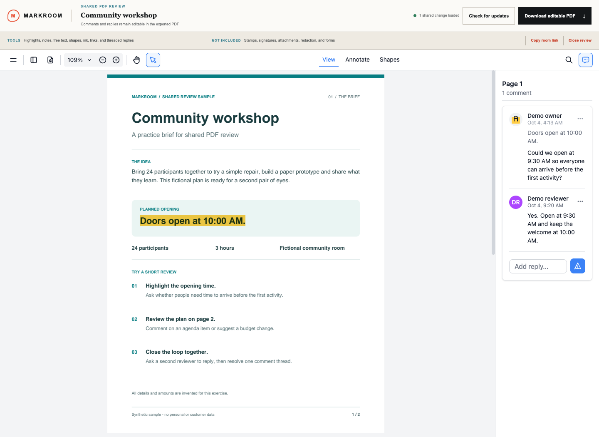

# Markroom

Markroom is a shared PDF review room. Upload one PDF, share its room link, add annotations and threaded replies, then freeze the review and download a PDF with editable comments. The source PDF stays unchanged. The viewer uses self-hosted EmbedPDF and PDFium; Cloudflare D1 stores review state and R2 stores PDF bytes.

This is an early self-hosted release. A room link grants access to the document, reviewer names, and comments. It is not an authenticated document-management system.



*A local review using the included sample PDF and fictional reviewer names. Synchronization uses **Check for updates**.*

See [known issues](KNOWN_ISSUES.md), the [dependency review](docs/dependency-review.md), and [security reporting](SECURITY.md) before hosting it for others.

The first source preview is described in the [v0.1.0 release notes](docs/releases/v0.1.0.md).

## Run locally

Use Node.js **22.13 or newer** and npm. No Cloudflare account or live resources are needed for local development.

```sh
npm ci
npm run db:migrate:local
npm run dev
```

Open the local URL printed by Vite and upload [Community workshop](examples/markroom-sample.pdf), the included two-page PDF with selectable text and entirely synthetic content. Use **Demo owner** as your display name, then open the share link in a second browser profile and join as **Demo reviewer**. Try highlighting **“Doors open at 10:00 AM.”** on page 1, add a comment about the opening time, and have the second reviewer reply. Use **Check for updates** to see each other's feedback.

Local D1/R2 data is stored in `.wrangler/state`, outside Git. Requests never create tables: apply migrations first. Back up existing installations before upgrades. Automatically created historical schemas without migration tracking must follow [schema adoption](docs/schema-upgrades.md). Configure a private local creation key using [hosting controls](docs/hosting-controls.md) before uploading; room creation is disabled until configured.

For the built Worker preview:

```sh
npm run build
npm start -- --port 4173
```

`npm start` runs Wrangler locally against `dist/server/wrangler.json`, using the same local persistence directory. It requires a preceding build. Run `npm run lint`, `npx tsc --noEmit`, and `npm test` for automated checks. [GitHub CI](.github/workflows/ci.yml) also installs the lockfile and applies migrations to an empty local database on Node 22.13 and 24. It requires no Cloudflare credentials and does not deploy. Source/asset assertions are not a substitute for the two-browser check below.

## Deploy to your own Cloudflare account

Deployment changes external resources and can incur charges. These commands are instructions for the operator; development/build never runs them automatically.

1. Authenticate with `npx wrangler login`. Create a D1 database using `npx wrangler d1 create markroom-db` and an R2 bucket using `npx wrangler r2 bucket create markroom-files`.
2. Copy `wrangler.jsonc` to `.env.wrangler.jsonc` (already ignored by `.env*`). Replace the placeholder database ID with the returned ID, and use your Worker name and actual database/bucket names. Keep the binding names `DB`, `FILES`, `ASSETS`, and `IMAGES`. The optional image route uses Cloudflare Images; the current static assets do not require dynamic image optimization.
3. Apply migrations to the new remote database, build with that configuration, and deploy the generated Worker:

```sh
npx wrangler d1 migrations apply DB --remote --config .env.wrangler.jsonc
MARKROOM_WRANGLER_CONFIG=.env.wrangler.jsonc npm run build
npm run deploy
```

The environment-variable syntax above is for macOS/Linux; PowerShell uses `$env:MARKROOM_WRANGLER_CONFIG = '.env.wrangler.jsonc'` before `npm run build`. The generated `dist/server/wrangler.json` contains the selected resource configuration. Rebuild whenever changing it. Do not deploy the default placeholder configuration or reuse another operator's project identifier.

Before serving traffic, configure separate creation/operator secrets and review the default budgets in [hosting controls](docs/hosting-controls.md). Run the two-browser smoke check against your new deployment. Room creation is restricted to trusted key holders. Operators still own edge traffic controls, backups, retention, and support.

### Existing Sites installations

The standalone source distribution omits installation-specific `.openai/hosting.json`. Existing operators should retain their private copy for maintenance. Standalone development/build does not load or package that project ID. With the installation's configuration present, Sites packaging is explicitly enabled with `MARKROOM_SITES=1 npm run build`; that path keeps the historical local binding names and packages Sites metadata/migrations. `.gitattributes` excludes `.openai` from Git source archives, and `.gitignore` prevents accidentally adding a restored local copy. Never publish credentials in configuration files or push an older repository history containing private installation metadata.

## Two-browser acceptance check

Use the included [two-page sample PDF](examples/markroom-sample.pdf) and fictional reviewer names. It contains no personal or customer data. The original sample has no annotations; review marks are added inside your room.

1. Create a room in browser A. Open its share link in browser B and join with another reviewer name.
2. Add a highlight and a note in A. In B, check for updates and reply to A's comment. Check for updates in A. Both must show the same thread.
3. Check that B cannot edit/delete A's annotation. Add a B annotation and verify both survive a reload.
4. Have A try to delete a comment with B’s reply: both browsers must retain the thread, with a clear rejection and no unsaved-change warning. Verify duplicate names are refused and only the actual owner has the owner role.
5. Close the review in A. Both sessions must reject further changes after refreshing/checking for updates.
6. Download the reviewed PDF and open it in a separate PDF editor. Confirm annotations, replies, page locations, and timestamps; check that comments remain editable. Compare the source PDF to confirm it is unchanged.

Repeat after viewer/framework upgrades. This smoke check does not establish full Acrobat compatibility or concurrency correctness.

For a migrated, built local preview, `node scripts/check-local-worker.mjs` also
checks admission, upload cleanup, names, roles, annotation writes, thread
preservation, rate limits, closing, security headers, and operator takedown.
It runs only on localhost and creates/deletes a synthetic room. Set
`MARKROOM_TEST_ORIGIN` (default `http://127.0.0.1:4173`),
`MARKROOM_TEST_CREATION_KEY`, and `MARKROOM_TEST_OPERATOR_KEY` to match that
preview. Its fallback keys are public test fixtures, never deployment secrets.

## Boundaries and privacy

- The server caps uploads at 100 MB, checks their PDF signature, and verifies the streamed byte count. The browser checks the 1–1,000 page range; the server only bounds that client-supplied page count and does not independently parse the whole PDF. Byte-range responses use actual stored object size.
- Each review is capped at 5,000 active annotation IDs, 10,000 retained IDs, and 4 MiB of serialized annotation data. The installation also caps annotation JSON at 64 MiB. Deletions erase contents and free active capacity while retaining bounded synchronization records. Trusted room creation reserves space against global room/PDF budgets before storage. See [all limits](docs/hosting-controls.md).
- Synchronization uses explicit **Check for updates**. Concurrent edits can conflict; review the displayed result rather than assuming live synchronization.
- Highlights, notes, text, shapes, ink, links, and threaded replies are supported. Stamps, signatures, attachments, redaction, and form editing remain disabled pending separate round-trip validation.
- Initiator and reviewer edit capabilities are browser-held tokens; the server stores token hashes. Preserve the initiator's browser state. There is no account-based recovery workflow.
- Anyone with a room link can view its PDF, names, and comments. Share links and browser-held edit capabilities should be treated as sensitive. This application does not promise end-to-end encryption.
- There is an authenticated [operator takedown command](docs/hosting-controls.md#inspect-and-take-down-rooms). There is no automated expiry, owner-facing deletion, link rotation, or backup/restore service. Operators remain responsible for logs, backups, and retention. Closing a room freezes changes; it does not delete its data or revoke read access.
- Do not use this early release for protected health information, payment-card data, or material not approved for the hosting environment. Hosting, request logs, and backups remain subject to the operator's policies.

## License and dependencies

Markroom's application code is licensed under the [GNU Affero General Public License, version 3 only (AGPL-3.0-only)](LICENSE). Copyright (c) 2026 Damn Kitty Works LLC. Two adapted deployment files, [build/sites-vite-plugin.ts](build/sites-vite-plugin.ts) and [worker/index.ts](worker/index.ts), remain MIT-licensed, including Markroom's changes, with OpenAI and Cloudflare attribution respectively. Dependencies retain their licenses. See [THIRD_PARTY_NOTICES.md](THIRD_PARTY_NOTICES.md) for exact EmbedPDF/PDFium terms and the remaining native-build provenance limitation.

Every page includes a **Source code** footer link to [this repository](https://github.com/damnkittyworks/markroom). Before serving a build, ensure that its users can access the complete corresponding source for the version running, including applicable build/install scripts. If you deploy a modified fork, update the footer link in `app/layout.tsx` to your fork and provide your modifications under AGPL-3.0. A link to a private repository or to an unmodified upstream version does not by itself provide the required source access. See [AGPL section 13](https://www.gnu.org/licenses/agpl-3.0.html#section13).

The pinned EmbedPDF package supplies browser assets during dev/build. Generated files under `public/lib/embedpdf` are ignored by Git, but include license texts, a package inventory, a binary hash, and a description of Markroom's UTC annotation-date patch. Do not strip these notices from distributed builds. Keep `package-lock.json` and use `npm ci` for reproducibility.

Before publishing a release, resolve applicable security advisories against the actual built runtime, verify the fresh-clone path, and run the smoke check. Remaining findings are recorded in the [dependency review](docs/dependency-review.md). Follow [SECURITY.md](SECURITY.md) to report suspected vulnerabilities privately; do not post live room links, tokens, PDFs, or exploit data in public issues.

### Source publication and built releases

The Git source excludes downloaded dependencies and generated viewer binaries. Publishing that source is a separate decision from distributing a built application. Preserve the file-specific licenses and notices when sharing it.

An official prebuilt download or public browser deployment remains gated on the exact PDFium binary's native-library/font manifest and required notices. Serving the app sends its WASM to browsers, even without a downloadable release archive. Generated JavaScript notices do not close this native provenance gap. See [the release boundaries](KNOWN_ISSUES.md#dependencies-and-distributed-assets).
